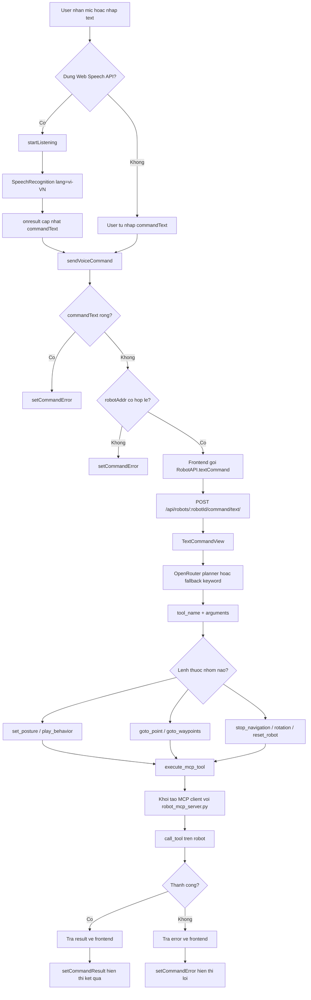
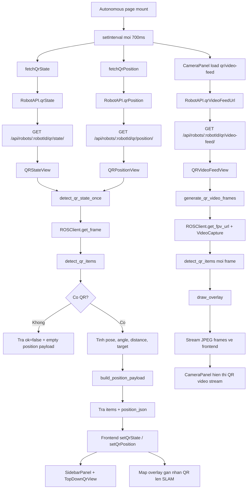

# AI VOICE and QR Flowcharts

## 1. AI VOICE flow

## 2. QR flow

## 3. Quick notes

- `AI VOICE` frontend: `frontend/app/autonomous/page.tsx`
- `AI VOICE` API client: `frontend/app/lib/robotApi.ts`
- `AI VOICE` backend: `backend/control/views.py`, `backend/control/services/mcp_voice.py`
- `QR` frontend: `frontend/app/autonomous/page.tsx`
- `QR` backend: `backend/control/views.py`, `backend/control/services/qr_detect.py`, `backend/control/services/qr_detector.py`
